# SecureVault: Zero-Knowledge Password Security and Encrypted Vault Management System

SecureVault is an academic cybersecurity project developed for ICT932 – Cybersecurity Testing and Assurance. The system demonstrates password security, encrypted vault management, two-factor authentication, session controls, RBAC, audit logging, and DevSecOps security testing in a Flask web application.

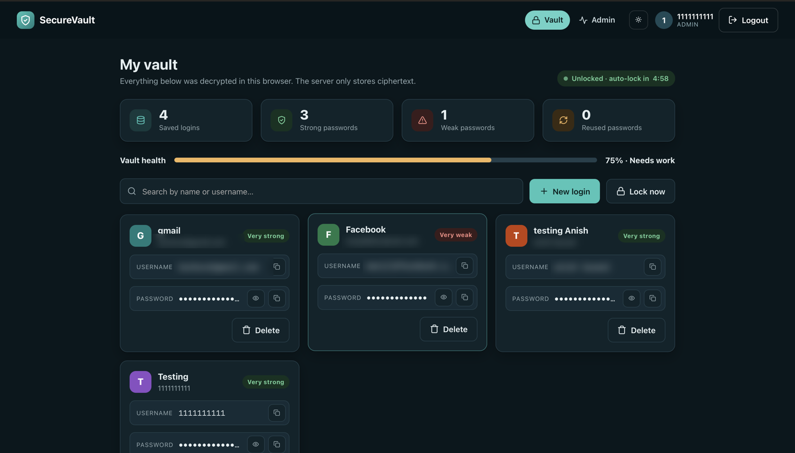

This project is a zero-knowledge-style academic prototype designed for learning and demonstration. It stores encrypted vault records rather than plaintext secrets and treats the server as an untrusted storage layer for ciphertext. However, this is not a formally verified zero-knowledge cryptographic protocol and should not be interpreted as a production-grade cryptographic system.

## Overview

The application provides:
- secure registration and login
- Argon2id password hashing
- TOTP-based 2FA
- role-based access control
- secure session timeout
- browser-side cryptographic password generation and minimum passphrase length checks
- encrypted vault storage using AES-256-GCM
- audit logging for security events
- CI/CD and security testing automation
- an interactive web interface: guided sign-up and 2FA, a searchable vault with copy/reveal controls, a password generator, vault health checks, an admin dashboard, and light/dark themes (see [User Interface](#user-interface))

## Problem

Users commonly reuse weak passwords, store secrets in plaintext, and expose credentials to password management systems with insufficient protection. Academic environments require practical demonstrations of secure design patterns, defensive coding, and verification workflows.

## Objectives

- implement secure user authentication and authorization
- demonstrate encrypted vault storage with authenticated encryption
- enforce access controls and session controls
- show secure logging and auditability
- integrate automated security testing in CI/CD
- provide a realistic but educational cybersecurity project

## Architecture

The app follows a layered architecture:
- browser client with HTTPS
- Flask application with auth, vault, and admin modules
- SQLite database for persistence
- crypto layer using AES-256-GCM for vault secrets
- audit and monitoring layer for security events

## Security Controls

- Argon2id password hashing
- AES-256-GCM authenticated encryption
- TOTP 2FA
- CSRF protection for forms
- secure cookie settings
- automatic session timeout
- rate limiting for authentication attempts
- server-side authorization checks
- sanitized and audited security events
- dependency and secret scanning in CI/CD

## Zero-Knowledge-style Architecture

This project stores only ciphertext and metadata in the database. The server is not expected to possess plaintext vault values, and each vault entry is encrypted before persistence. This is a zero-knowledge-style design for learning and academic demonstration, but it is not a formally verified zero-knowledge proof system or cryptographic protocol.

## Repository Structure

- src/ – application source code
- tests/ – pytest test suite
- docs/ – architecture, threat model, security testing, and incident response documentation
- ci-cd/ – CI/CD notes
- .github/workflows/ – GitHub Actions pipeline
- scripts/ – database initialization scripts
- docs/screenshots/ – interface screenshots used in this README

## Implemented MVP

See [MVP operations and threat model](docs/MVP.md) for the implemented flows, security boundaries, testing, and database compatibility. Python 3.14 and Node 24 are the validated runtimes. Use a separate master passphrase: it is never sent to the server. Labels, usernames, and passwords are encrypted in the browser. No server-side AES vault key is used.

## User Interface

The interface was redesigned so the security controls are visible and easy to use. Only templates, CSS and browser JavaScript changed; the Flask backend, API, database models and vault cryptography are unchanged, and everything stays within the existing Content-Security-Policy (no inline scripts or styles). All 16 pytest tests and the Node crypto test still pass.

### 1. Sign in and create an account

| Sign in | Create account (live checks) |
| --- | --- |
| 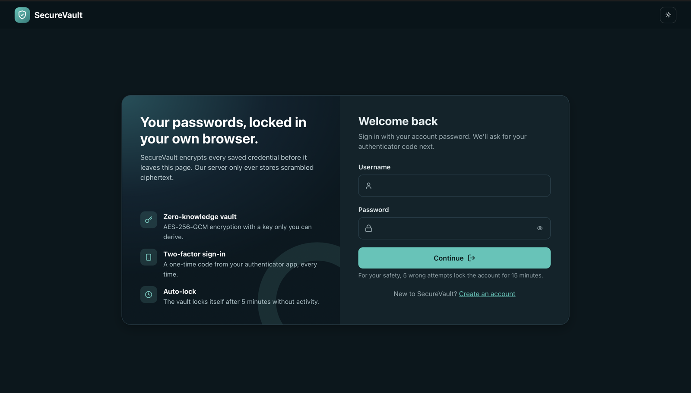 | 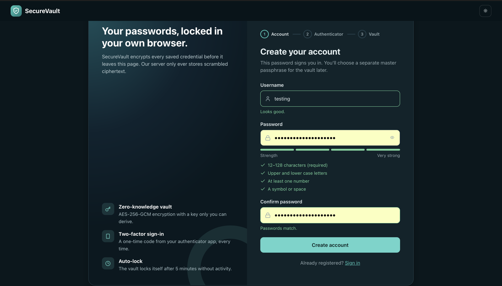 |

- Show/hide password button and a Caps Lock warning
- Live password strength meter with a checklist (12–128 characters, mixed case, number, symbol)
- Confirm-password field and live username validation (3–80 characters: letters, numbers, `. _ -`)
- A 1-2-3 stepper shows progress: Account → Authenticator → Vault
- The sign-in page reminds users that 5 wrong attempts lock the account for 15 minutes

### 2. Two-factor authentication (mandatory)

| Connect an authenticator | Code in the authenticator app |
| --- | --- |
| 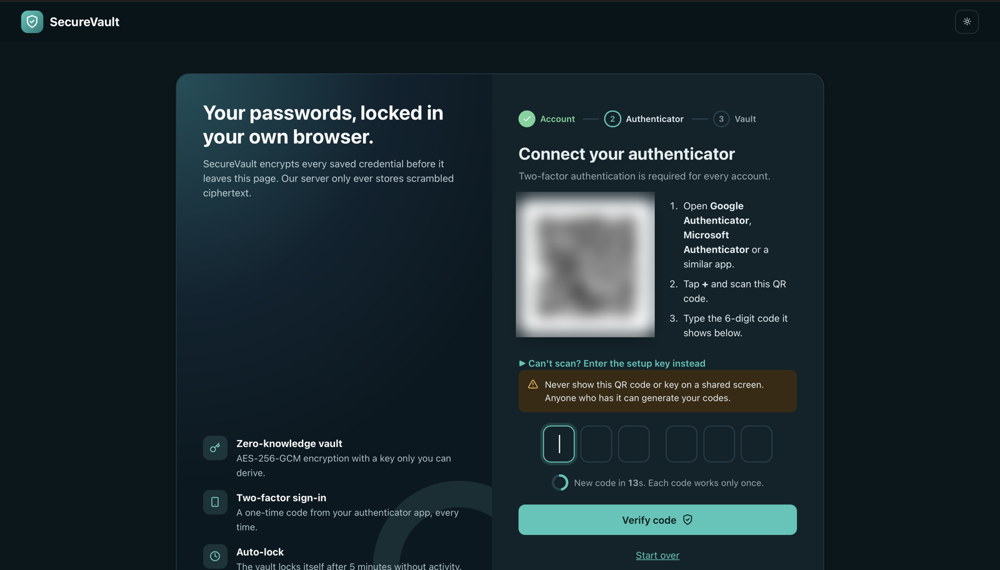 | 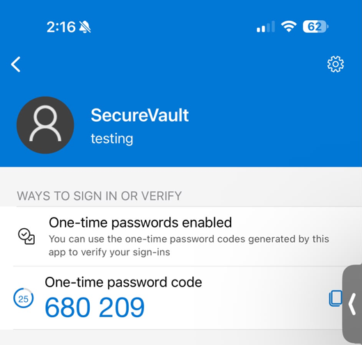 |

- Scan the QR code with Google Authenticator, Microsoft Authenticator or a similar app
- The setup key is hidden behind "Can't scan?" with a copy button, and a warning says never to show the QR code on a shared screen (it is blurred in this screenshot for that reason)
- Six separate digit boxes that submit automatically when complete; pasting a code works
- A countdown ring shows when the next code arrives; each code can only be used once

### 3. Create and unlock the vault

| First unlock (confirm passphrase) | Locked vault |
| --- | --- |
| 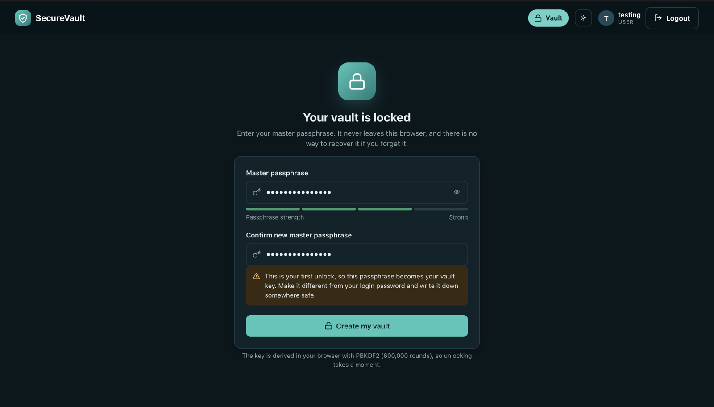 | 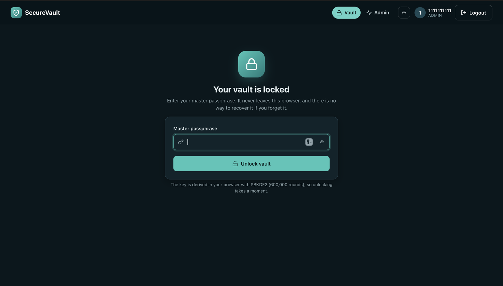 |

- The master passphrase is separate from the login password and never leaves the browser
- **On the first unlock the passphrase must be typed twice**, so a typo cannot permanently lock the vault (there is no recovery by design)
- A strength meter guides the choice of passphrase
- The key is derived in the browser with PBKDF2-HMAC-SHA-256 (600,000 rounds), so unlocking shows a short loading state

### 4. Work with the vault

| Empty vault | Add a login with the generator |
| --- | --- |
| 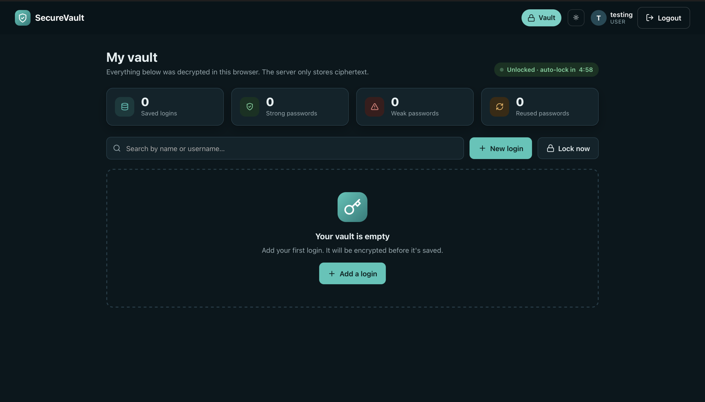 | 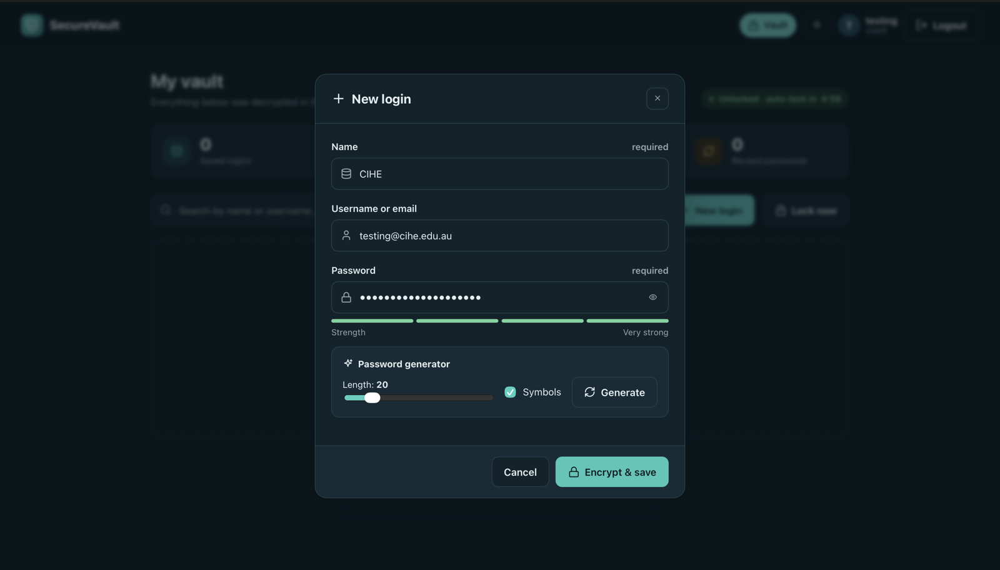 |

| First saved login | Vault with several logins |
| --- | --- |
| 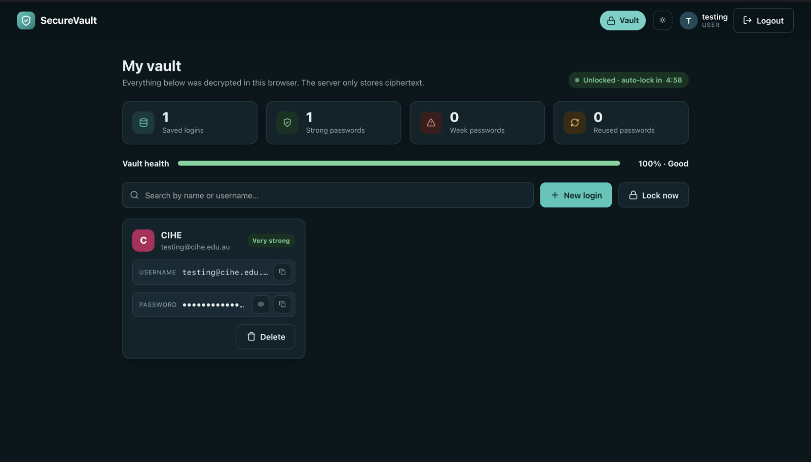 |  |

- Each login is a card with reveal and copy buttons; the clipboard is cleared after 30 seconds
- Search by name or username
- "New login" dialog with a password generator (length slider 12–64, symbols on/off) and a strength meter
- Vault health: counts of strong, weak and reused passwords plus an overall score, all computed in the browser, never sent to the server
- Delete needs a second click to confirm
- A live countdown shows when the vault will auto-lock (5 minutes without activity); "Lock now" locks it immediately

### 5. Admin dashboard

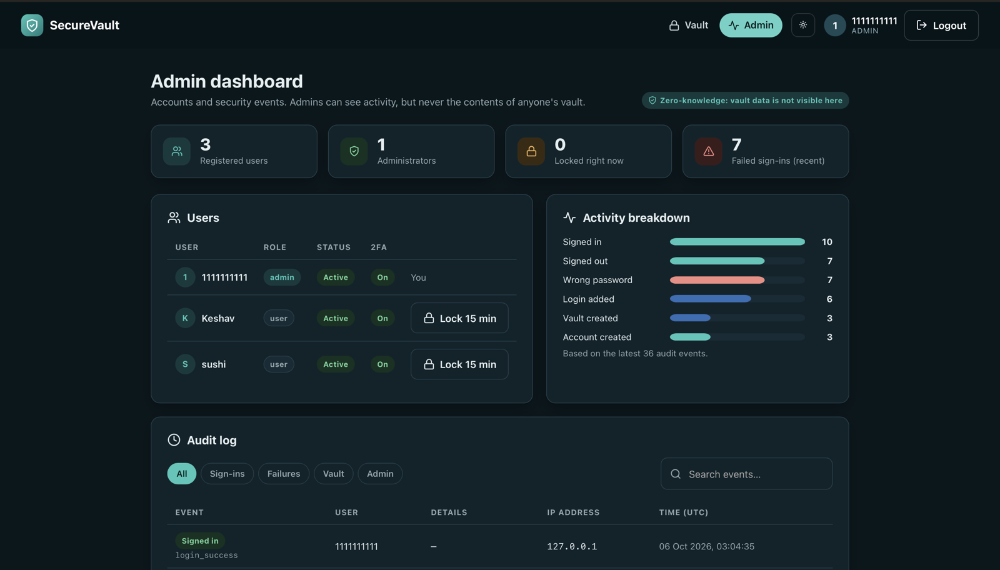

- Stat cards: registered users, administrators, accounts locked right now, recent failed sign-ins
- Activity breakdown chart of recent audit events
- User table with role, status and 2FA badges, and a lock button that needs a second click
- Audit log with filters (Sign-ins, Failures, Vault, Admin), search, readable event names, usernames and IP addresses
- Admins see activity only. Vault contents are never visible here because they are encrypted in each user's browser

Grant the admin role from a trusted local terminal:

```bash
python -m flask --app src.app make-admin YOUR_USERNAME
```

### Also new

- Light/dark theme switch in the top bar (remembered per browser)
- Pop-up notifications for success, warnings and errors
- Responsive layout that works on phones

## Installation

1. Clone the repository
2. Create a virtual environment
3. Install dependencies
4. Configure environment variables
5. Initialize the database
6. Run the app

```bash
python3.14 -m venv .venv
source .venv/bin/activate
pip install -r requirements.txt
cp .env.example .env
# Generate a secret and paste it into SECRET_KEY in .env:
python -c "import secrets; print(secrets.token_hex(32))"
python scripts/init_db.py
python src/app.py
```

## Environment Setup

The project uses environment variables defined in `.env`.

Example:

```env
SECRET_KEY=PASTE_A_RANDOM_64_CHARACTER_HEX_VALUE
DATABASE_URL=sqlite:///securevault.db
SESSION_COOKIE_SECURE=False
APP_ENV=development
```

Do not commit `.env` or any private key material.

## Database Initialization

```bash
python scripts/init_db.py
```

## Running Instructions

```bash
python -m flask --app src.app run
```

Or directly:

```bash
python src/app.py
```

Then open http://127.0.0.1:5000.

### Updating an existing copy

```bash
git checkout main
git pull
source .venv/bin/activate
python src/app.py
```

No new dependencies are needed. Existing accounts, `.env` and the database keep working. After updating, hard-refresh the browser (Cmd+Shift+R on macOS, Ctrl+Shift+R on Windows/Linux) so it loads the new CSS and JavaScript.

## Testing Instructions

```bash
pytest -q --cov=src                        # 16 tests
node --test tests/vault_crypto.test.cjs    # browser crypto: round trip, wrong key, tampering
ruff check src tests scripts
```

## Security Testing Instructions

```bash
bandit -r src
pytest -q
pip-audit
```

## GitHub Actions Explanation

The repository includes a security-focused GitHub Actions workflow in `.github/workflows/security.yml` that runs:
- checkout
- Python setup
- dependency installation
- linting
- static application security testing
- unit tests
- dependency vulnerability scanning
- secret scanning
- build/startup validation

The pipeline is configured to fail when serious issues are detected.

## Ethical Testing Statement

This project is intended for local or explicitly authorized lab environments only. Testing must not target systems without appropriate permission. The security testing documentation applies to this project and other authorized lab environments only.

## Limitations

This is an academic prototype and not a production-certified zero-knowledge system. It demonstrates secure patterns and encryption use while keeping the implementation understandable for learning and assessment.

## Team Member Responsibilities

- Banish Kumar Sapkota — Student ID: CIHE250
- Manjil Khanal — Student ID: CIHE250

## Academic Evidence

Captured from a local run (see [User Interface](#user-interface)):

- Login Page: [04-login.png](docs/screenshots/04-login.png)
- Registration: [05-register.png](docs/screenshots/05-register.png), [06-register-strength.png](docs/screenshots/06-register-strength.png)
- 2FA Setup: [07-two-factor-setup.png](docs/screenshots/07-two-factor-setup.png), [08-authenticator-app.png](docs/screenshots/08-authenticator-app.png)
- User Dashboard / Encrypted Vault: [09-first-unlock.png](docs/screenshots/09-first-unlock.png), [10-vault-empty.png](docs/screenshots/10-vault-empty.png), [11-add-login.png](docs/screenshots/11-add-login.png), [12-vault-saved.png](docs/screenshots/12-vault-saved.png), [02-vault-unlocked.png](docs/screenshots/02-vault-unlocked.png), [03-vault-locked.png](docs/screenshots/03-vault-locked.png)
- Admin Dashboard and Audit Log: [01-admin-dashboard.png](docs/screenshots/01-admin-dashboard.png)

Personal details (names, email addresses) and the 2FA QR code are blurred in the published screenshots.

Still to capture:

[INSERT SCREENSHOT: GitHub Repository]
[INSERT SCREENSHOT: GitHub Commit History]
[INSERT SCREENSHOT: Database Ciphertext]
[INSERT SCREENSHOT: GitHub Actions Pipeline]
[INSERT SCREENSHOT: Bandit Result]
[INSERT SCREENSHOT: Gitleaks Result]
[INSERT SCREENSHOT: pip-audit Result]
[INSERT SCREENSHOT: OWASP ZAP Result]
[INSERT SCREENSHOT: Vulnerability Before Remediation]
[INSERT SCREENSHOT: Successful Re-test]
